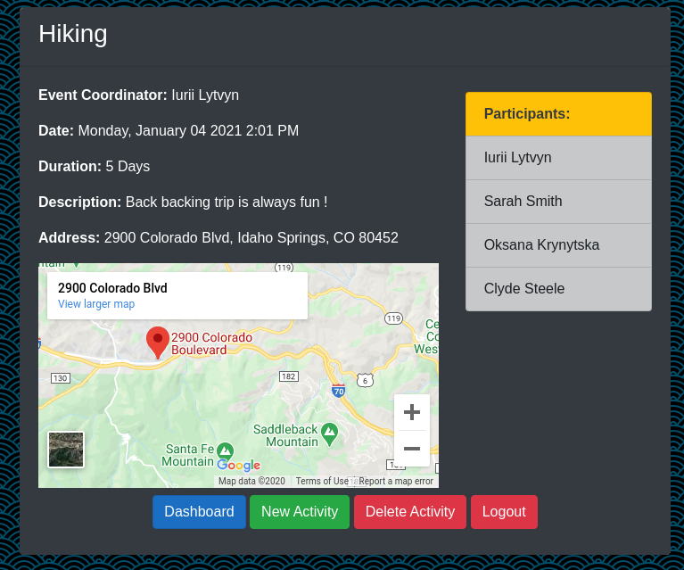

# Activity Center Gmaps
This app allows you to create users, and create different activities, it's many to many relationship, so different users can join different activities. I've implemented google maps API, so you can see a little map when you entering an address.
Stack: C#/ASP.NET/Entity/SQL/Google maps API

## Hosted by AWS
I don't know how long I'll keep it alive, but it's here http://18.218.72.111

## Install Entity Framework
```cs
dotnet tool install dotnet-ef --global
```
## Edit appsettings.json
You have to replace XXXX with your SQL server login and password
```
cd ActivityCenterGmaps
vim appsettings.json
# on line 13
# ...userid=XXXX;password=XXX;port=3306;...
```

## Adding gmaps API
of course you should have your own API key, please follow instruction
```
cd Views/Home
vim DisplayActivity.cshtml
```
and insert your API key on line 25
```
src="https://www.google.com/maps/embed/v1/place?key=XXXXXXXXXXXXX&q=@Model.Location" allowfullscreen>
```

## Restore project
```
dotnet restore
```

## Migrate SQL db's
Create appropriate schema in our db
```
dotnet ef migrations add initial -v
dotnet ef database update -v
```

## Run
```
dotnet watch run
```

## Localhost
to open app go to 
```
http://localhost:5000 
```

## Screenshot
